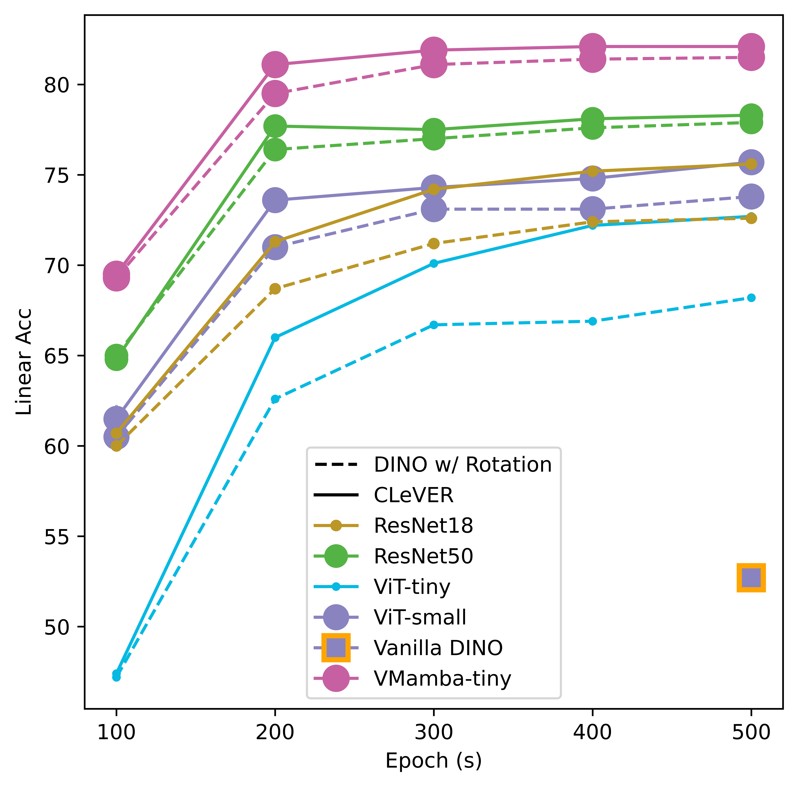

# CLeVER

[]()
[]()
[]()
[]()

Pytorch implementation of **[CLeVER (Contrastive Learning Via Equivariant Representation)]()**. (Arxiv version is currently scheduled to be announced at Tue, 4 Jun 2024 00:00:00 GMT. 🚀)


If you find our CLeVER useful in your research, please star this repository and consider citing:

```
🚀
```

## Table of Content

- 1. Updates

- 2. Supported Backbone Models
- 3. Getting Started
- 4. Evaluation
- 5. Acknowledgement

## 1. Updates

- 30/May/2024: The code repository is publicly available.

## 2. Supported Backbone Models

CLeVER framework currently is compatible with augmentation strategies of **arbitrary complexity** for various **mainstream backbone models**.

- **ResNet (Convolutional Modules)**
- **ViT (Multi-Head Self-Attention Modules)**
- **VMamba (2D Selective Scan Modules)**
- We find that **VMamba has surprising performance gains** from equivariance within the CLeVER framework (also within contrastive learning / self-supervised learning framework). This suggests that the integration of equivariant factors not only improves robustness and generalization but also **maximizes the potential** of innovative backbone architectures like VMamba.

Comparison of the performance of various backbone models pre-trained with CLeVER and DINO on ImageNet-100. All performances are evaluated under rotational perturbation. 

<div align="center">
	
</div>

#### Linear Evaluation on ImageNet-100, 200 epochs (Training with CAug\*, and evaluating with Orignal images / Orignal images + ColorJitter + RandomRotation -90~90)

<div align="center">
| Backbones   | Methods    | Params | GFLOPs | Top1-Ori | Top1-Ori+CJ+R |
| ----------- | ---------- | ------ | ------ | -------- | ------------- |
| ViT-Tiny    | DINO       | 5.5M   | 1.26G  | 66.2     | 62.6          |
|             | **CLeVER** | 5.5M   | 1.26G  | **68.7** | **66.0**      |
| ViT-Small   | DINO       | 21.7M  | 4.61G  | 73.2     | 71.0          |
|             | **CLeVER** | 21.7M  | 4.61G  | **75.7** | **73.6**      |
| ResNet18    | DINO       | 11.2M  | 1.83G  | 71.5     | 68.7          |
|             | **CLeVER** | 11.2M  | 1.83G  | **74.2** | **71.3**      |
| ResNet50    | DINO       | 23.5M  | 4.14G  | 78.4     | 76.4          |
|             | **CLeVER** | 23.5M  | 4.14G  | **79.1** | **77.7**      |
| VMamba-Tiny | DINO       | 29.5M  | 4.84G  | 80.9     | 79.5          |
|             | **CLeVER** | 29.5M  | 4.84G  | **82.9** | **81.1**      |
</div>

(\* Compared to default augmentation setting used in DINO (*i.e.*, BAug), the CAug has an additional “transforms.RandomRotation(degrees=(-90, 90))” for all input images.)

## 3. Getting Started

### Installation

We have found that installing the environment identical to [`vmunet`](https://github.com/JCruan519/VM-UNet) enables successful execution of DINO or CLeVER with all mainstream backbones (ResNet, ViT, VMamba).

If you only intend to run DINO or CLeVER with classic backbones (ResNet, ViT), you have the option to simply install the environment using

```bash
conda env create -f CLeVER.yml
conda install CLeVER
```

### Pre-training

With the configuration for pre-training

```bash
PORT_NUM=25606
GPU_num=4 ## 4GPU
DEVICES=0,1,2,3
net_name=CLeVER ##dino, CLeVER
backbone_name=vit_tiny ## resnet18, resnet50, vit_tiny, vit_small, vssm2-vmambav2_tiny_224
EPOCH=200
DATASET=IN100 ##Imagenet, IN100
DATASET_PATH=<path to imagenet-100 or imagenet>
OTHER_PARA=("65536" "" "" "" "_reg0.001") ## ("DVR_out_dim: 410/2048/16384/65536" "NA" "NA" "NA" "_reg0.001/blank")
HP1=("0.8") ## hyperparameter for separation ratio of representations of IR and EF (default 0.8).
BATCH=("128") ## 128 for 4*GPUs / 256 for 2*GPUs
AUG_TYPE=("aug1_2") ## different augmentation types: aug1=BAug, aug1_2=CAug, aug1_4_2=CAug+ (identical to the manuscript)
SEP_LAMBD=("1.0") ## The coefficient of DVR loss (default 1.0)

Result_dir=<path to output path>
PARA_dir=${DATASET}_ep${EPOCH}/${net_name}_${backbone_name}/${AUG_TYPE[0]}/${BATCH[0]}/${HP1[0]}/
TRIAL_name=${net_name}_${backbone_name}_${BATCH[0]}_${HP1[0]}_${OTHER_PARA[0]}_${SEP_LAMBD[0]}${OTHER_PARA[4]}
mkdir -p ${Result_dir}/${PARA_dir}/${TRIAL_name}/
```

The pre-training can be conducted by

```bash
## Pretraining
CUDA_VISIBLE_DEVICES=${DEVICES} OMP_NUM_THREADS=1 python -m torch.distributed.launch --nproc_per_node=${GPU_num} --master_port=${PORT_NUM} main_dino.py --net ${net_name} --arch ${backbone_name} --data_path ${DATASET_PATH}/train --output_dir ${Result_dir}/${PARA_dir}/${TRIAL_name}/ --epochs ${EPOCH} --batch_size_per_gpu ${BATCH[0]} --aug ${AUG_TYPE[0]} --hp1 ${HP1[0]} --DVR_out_dim ${OTHER_PARA[0]} --sep_lambd ${SEP_LAMBD[0]} --reg_lambd ${OTHER_PARA[4]} --saveckp_freq 100 > ${Result_dir}/${PARA_dir}/${TRIAL_name}/result_pretrain_${TRIAL_name}.txt
```

## 4. Evaluation

### Linear Probe

With the configuration for pre-training (identical to the subsection "Pre-training")

and with the configuration for linear evaluation

```bash
GPU_num_LN=2
DEVICES_LN=0,1
BATCH_LN=128
OTHER_LINEAR_PARA=("sgd" "0.001" "" "100")
```

The linear evaluation can be conducted by

```bash
## For dino and CLeVER
## linear probe using full representation
CUDA_VISIBLE_DEVICES=${DEVICES_LN} OMP_NUM_THREADS=1 python -m torch.distributed.launch --nproc_per_node=${GPU_num_LN} --master_port=${PORT_NUM} eval_linear.py --net ${net_name} --arch ${backbone_name} --pretrained_weights ${Result_dir}/${PARA_dir}/${TRIAL_name}/checkpoint.pth --output_dir ${Result_dir}/${PARA_dir}/${TRIAL_name}/ --trial_name ${TRIAL_name} --data_path ${DATASET_PATH} --dataset_type ${DATASET} --batch_size_per_gpu ${BATCH_LN} --lr ${OTHER_LINEAR_PARA[1]} --epochs ${OTHER_LINEAR_PARA[3]} --hp1 ${HP1[0]} --else_part ALL --n_last_blocks 4 > ${Result_dir}/${PARA_dir}/${TRIAL_name}/result_linear_${OTHER_LINEAR_PARA[1]}_${OTHER_LINEAR_PARA[3]}_${TRIAL_name}.txt

## For CLeVER only
## linear probe using only invariant representation (IR)
CUDA_VISIBLE_DEVICES=${DEVICES_LN} OMP_NUM_THREADS=1 python -m torch.distributed.launch --nproc_per_node=${GPU_num_LN} --master_port=${PORT_NUM} eval_linear.py --net ${net_name} --arch ${backbone_name} --pretrained_weights ${Result_dir}/${PARA_dir}/${TRIAL_name}/checkpoint.pth --output_dir ${Result_dir}/${PARA_dir}/${TRIAL_name}/ --trial_name ${TRIAL_name} --data_path ${DATASET_PATH} --dataset_type ${DATASET} --batch_size_per_gpu ${BATCH_LN} --lr ${OTHER_LINEAR_PARA[1]} --epochs ${OTHER_LINEAR_PARA[3]} --hp1 ${HP1[0]} --else_part main_part --n_last_blocks 4 > ${Result_dir}/${PARA_dir}/${TRIAL_name}/result_linear_hp${HP1[0]}_${OTHER_LINEAR_PARA[1]}_${OTHER_LINEAR_PARA[3]}_${TRIAL_name}.txt

## linear probe using only equivariant factor (EF)
CUDA_VISIBLE_DEVICES=${DEVICES_LN} OMP_NUM_THREADS=1 python -m torch.distributed.launch --nproc_per_node=${GPU_num_LN} --master_port=${PORT_NUM} eval_linear.py --net ${net_name} --arch ${backbone_name} --pretrained_weights ${Result_dir}/${PARA_dir}/${TRIAL_name}/checkpoint.pth --output_dir ${Result_dir}/${PARA_dir}/${TRIAL_name}/ --trial_name ${TRIAL_name} --data_path ${DATASET_PATH} --dataset_type ${DATASET} --batch_size_per_gpu ${BATCH_LN} --lr ${OTHER_LINEAR_PARA[1]} --epochs ${OTHER_LINEAR_PARA[3]} --hp1 ${HP1[0]} --else_part else_part --n_last_blocks 4 > ${Result_dir}/${PARA_dir}/${TRIAL_name}/result_linear_hp${HP1[0]}_else_${OTHER_LINEAR_PARA[1]}_${OTHER_LINEAR_PARA[3]}_${TRIAL_name}.txt
```

### Performance Evaluation with perturbed input images

With the configuration for pre-training (identical to the subsection "Pre-training") and with the configuration for linear evaluation (identical to the subsection "Linear Probe")

and with the configuration for performance evaluation after linear probe 

```bash
GPU_num_EVAL=1
DEVICES_EVAL=0
```

The performance evaluation with perturbed input images can be conducted by

```bash
TEST_AUG_TYPE=("basic" "aug1" "aug1_2" "aug1_4_2")
for test_aug in {0..3..1}
do
## For dino and CLeVER
## evaluation using full representation
CUDA_VISIBLE_DEVICES=${DEVICES_EVAL} OMP_NUM_THREADS=1 python -m torch.distributed.launch --nproc_per_node=${GPU_num_EVAL} --master_port=${PORT_NUM} eval_linear.py --net ${net_name} --arch ${backbone_name} --pretrained_weights ${Result_dir}/${PARA_dir}/${TRIAL_name}/checkpoint.pth --output_dir ${Result_dir}/${PARA_dir}/${TRIAL_name}/ --trial_name ${TRIAL_name} --data_path ${DATASET_PATH} --dataset_type ${DATASET} --lr ${OTHER_LINEAR_PARA[1]} --epochs ${OTHER_LINEAR_PARA[3]} --hp1 ${HP1[0]} --else_part ALL --n_last_blocks 4 --test_aug_type ${TEST_AUG_TYPE[${test_aug}]} --evaluate --final_eval_weights ${Result_dir}/${PARA_dir}/${TRIAL_name}/checkpoint_linear_${OTHER_LINEAR_PARA[1]}_${OTHER_LINEAR_PARA[3]}_${TRIAL_name}.pth.tar > ${Result_dir}/${PARA_dir}/${TRIAL_name}/only_eval_${TEST_AUG_TYPE[${test_aug}]}_linear_${OTHER_LINEAR_PARA[1]}_${OTHER_LINEAR_PARA[3]}_${TRIAL_name}.txt

## For CLeVER only
## evaluation using only invariant representation (IR)
CUDA_VISIBLE_DEVICES=${DEVICES_EVAL} OMP_NUM_THREADS=1 python -m torch.distributed.launch --nproc_per_node=${GPU_num_EVAL} --master_port=${PORT_NUM} eval_linear.py --net ${net_name} --arch ${backbone_name} --pretrained_weights ${Result_dir}/${PARA_dir}/${TRIAL_name}/checkpoint.pth --output_dir ${Result_dir}/${PARA_dir}/${TRIAL_name}/ --trial_name ${TRIAL_name} --data_path ${DATASET_PATH} --dataset_type ${DATASET} --lr ${OTHER_LINEAR_PARA[1]} --epochs ${OTHER_LINEAR_PARA[3]} --hp1 ${HP1[0]} --else_part main_part --n_last_blocks 4 --test_aug_type ${TEST_AUG_TYPE[${test_aug}]} --evaluate --final_eval_weights ${Result_dir}/${PARA_dir}/${TRIAL_name}/checkpoint_linear_hp${HP1[0]}_${OTHER_LINEAR_PARA[1]}_${OTHER_LINEAR_PARA[3]}_${TRIAL_name}.pth.tar > ${Result_dir}/${PARA_dir}/${TRIAL_name}/only_eval_${TEST_AUG_TYPE[${test_aug}]}_linear_hp${HP1[0]}_${OTHER_LINEAR_PARA[1]}_${OTHER_LINEAR_PARA[3]}_${TRIAL_name}.txt

## evaluation using only equivariant factor (EF)
CUDA_VISIBLE_DEVICES=${DEVICES_EVAL} OMP_NUM_THREADS=1 python -m torch.distributed.launch --nproc_per_node=${GPU_num_EVAL} --master_port=${PORT_NUM} eval_linear.py --net ${net_name} --arch ${backbone_name} --pretrained_weights ${Result_dir}/${PARA_dir}/${TRIAL_name}/checkpoint.pth --output_dir ${Result_dir}/${PARA_dir}/${TRIAL_name}/ --trial_name ${TRIAL_name} --data_path ${DATASET_PATH} --dataset_type ${DATASET} --lr ${OTHER_LINEAR_PARA[1]} --epochs ${OTHER_LINEAR_PARA[3]} --hp1 ${HP1[0]} --else_part else_part --n_last_blocks 4 --test_aug_type ${TEST_AUG_TYPE[${test_aug}]} --evaluate --final_eval_weights ${Result_dir}/${PARA_dir}/${TRIAL_name}/checkpoint_linear_hp${HP1[0]}_else_${OTHER_LINEAR_PARA[1]}_${OTHER_LINEAR_PARA[3]}_${TRIAL_name}.pth.tar > ${Result_dir}/${PARA_dir}/${TRIAL_name}/only_eval_${TEST_AUG_TYPE[${test_aug}]}_linear_hp${HP1[0]}_else_${OTHER_LINEAR_PARA[1]}_${OTHER_LINEAR_PARA[3]}_${TRIAL_name}.txt
done
```

### Downstream Classification Task

🚀

### Downstream Video Object Segmentation 

To evaluate the representation quality of pre-trained ViT models in DAVIS 2017 dataset, please follow the instructions of [Evaluation: DAVIS 2017 Video object segmentation](https://github.com/facebookresearch/dino) provided in the official DINO repository.

### Downstram Unsupervised Saliency Detection

To evaluate the representation quality of pre-trained ViT models in ECSSD, DUTS, DUT_OMRON dataset, please follow the instructions of [4.2 Unsupervised saliency detection](https://github.com/YangtaoWANG95/TokenCut?tab=readme-ov-file) provided in the official TokenCut repository.

## 5. Acknowledgments

Thanks Simsiam ([official](https://github.com/facebookresearch/simsiam), [small datasets](https://github.com/Reza-Safdari/SimSiam-91.9-top1-acc-on-CIFAR10)), DINO ([official](https://github.com/facebookresearch/dino)), TokenCut ([official](https://github.com/YangtaoWANG95/TokenCut?tab=readme-ov-file)), and VMamba ([official](https://github.com/MzeroMiko/VMamba/tree/main)) for their public code and released models. We appreciate their efforts.
